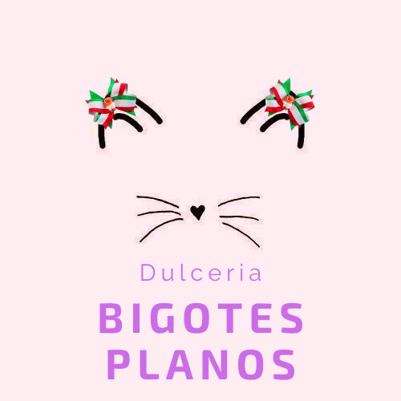

  
<h1> 
 Bigotes-Planos  
  </h1>
Página vendedora de dulces mexicanos

<ul>
<li><a href="#">Dulces Tipicos</a></li>
<li><a href="#">Dulces Picositos</a></li>
<li><a href="#">Chocolates</a></li>
</ul>
	<h2>Los dulces mexicanos son una tradición y un manjar que te alegran el corazón, te invito a conocer más de ellos.</h2>
    
 ¿Sabías que nuestros dulces mexicanos típicos surgieron gracias a la mezcla de ingredientes de nuestras tierras y los que llegaron de otros países? 

    
